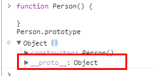

## 前言

原型链有几个概念

构造函数,原型，prototype,实例。

首先来说一下构造函数

## 构造函数

person 是一个普通的函数

```javascript
function person() {}
```

当一个普通函数被`new`操作符执行的时候，那么他就是`构造函数`

```javascript
function Person() {}
var person = new Person();
person.name = 'liwens';
console.log(person.name); // liwens
```

另外要注意的是，函数名`Person`是以大写`P`字母开头的。在《JavaScript 高级程序设计第三版》P145 页中提到

> 按照惯例，构造函数始终都应该是以一个大写字母开头，而非构造函数应该以一个小写字母开头

## 原型 和 prototype 的关系

原型 是什么？ 答: 原型 其实是一个对象，一般以 Xxx.prototype 表示

prototype 是什么？ 答: 通俗的讲 prototype 是 构造函数 和 原型 之间的**链接** (专业点讲叫 委托）。<br>
每一个对象( 函数也是对象 )在创建的时候都会通过`prototype`关联一个对象( null 除外 ),这个对象就是原型。<br>
让我们用一张图表示构造函数和实例原型之间的关系：


## 实例

实例就是通过 `new`操作符调用 构造函数 生成的对象,如下面代码的 `person1` 就是 实例

```javascript
function Person() {}
var person1 = new Person();
```

## 实例和原型的的关系

每一个实例都会自带一个属性 \_\_proto\_\_，这个属性会指向实例的原型<br>
为了证明这一点,我们可以在火狐或者谷歌中输入

```javascript
function Person() {}
var person = new Person();
console.log(person.__proto__ === Person.prototype); // true
```

于是我们更新下关系图


同一个构造函数生成的实例，都指向同一个原型

```javascript
function Person() {

}
Person.prototype = {
  //这里需要注意的是，我们说过原型的一个对象。我们这种写法实际上是把原型指向了另外一个对象。所以需要把constructor属性指回构造函数
  constructor: Person,
  name: 'liwens';
}
var person1 = new Person();
var person2 = new Person();
console.log(person1.name) // liwens
console.log(person2.name) // liwens
```

## constructor

上面讲到构造函数通过 prototype 指向原型，实例通过 \_\_proto\_\_ 指向 原型

而原型是通过 constructor 属性指回构造函数的, 这样构造函数和原型都相互关联了

为了验证这一点，我们可以尝试：

```
function Person() {

}
console.log(Person === Person.prototype.constructor); // true
```

我们再更新原型图


综上我们已经得出：

```
function Person() {

}

var person = new Person();
//实例通过 __proto__ 指向 原型
console.log(person.__proto__ == Person.prototype) // true
//原型通过 constructor 指向构造函数
console.log(Person.prototype.constructor == Person) // true
// 顺便学习一个ES5的方法,可以获得对象的原型
console.log(Object.getPrototypeOf(person) === Person.prototype) // true
```

## 实例与原型 从下往上，找到为止。

读取一个实例的属性时，首先会在实例中找，如果找不到，就会根据 实例 的 \_\_proto\_\_ 属性去到原型中找,找不到就去原型的原型找，一直找到最顶层为止

```javascript
function Person() {}

Person.prototype.name = 'liwens';

var person = new Person();

person.name = 'Daisy';
console.log(person.name); // Daisy

delete person.name;
console.log(person.name); // liwens
```

在这个例子中，我们给实例对象 person 添加了 name 属性，当我们打印 person.name 的时候，结果自然为 Daisy。

但是当我们删除了 person 的 name 属性时，读取 person.name，从 person 对象中找不到 name 属性就会从 person 的原型也就是 person.**proto** ，也就是 Person.prototype 中查找，幸运的是我们找到了 name 属性，结果为 Kevin。

但是万一还没有找到呢？原型的原型又是什么呢？

## 原型的原型

其实原型也是实例,他也有\_\_proto\_\_ 属性,我们可以输出看一下原型的原型是什么

```
function Person() {

}
console.log(Person.prototype)
```



可以看到，原型对象就是通过 Object 构造函数生成的，在 JavaScript 中， Object 是一切对象的源头
，所以我们再更新下关系图：


## 原型链

那 Object.prototype 的原型呢？

null，我们可以打印：
`console.log(Object.prototype.__proto__ === null) // true`
然而 null 究竟代表了什么呢？

引用阮一峰老师的 [《undefined 与 null 的区别》](http://www.ruanyifeng.com/blog/2014/03/undefined-vs-null.html) 就是：

> null 表示“没有对象”，即该处不应该有值。
> 所以 Object.prototype.**proto** 的值为 null 跟 Object.prototype 没有原型，其实表达了一个意思。

所以查找属性的时候查到 Object.prototype 就可以停止查找了。

最后一张关系图也可以更新为：


顺便还要说一下，图中由相互关联的原型组成的链状结构就是原型链，也就是蓝色的这条线。

## es6 class 写法

我们通篇介绍的原型链都是 es5 的写法，这种写法跟传统的面向对象语言（比如 C++ 和 Java）差异很大，很容易让新学习这门语言的程序员感到困惑。

所以 ES6 提供了更接近传统语言的写法

```javascript
//ES5 写法
function Person() {
  this.name = liwens;
}
Person.prototype.getName = function() {
  return this.name;
};

//ES6 写法
class Person {
  constructor() {
    this.name = liwens;
  }
  getName() {
    return this.name;
  }
}
```

可以看到 ES6 class 写法更加清晰，也有封装的感觉。但 class 写法只是语法糖，也是基于 ES5 写法封装的。 我们还是很有必要学习原型链的原理的

更多内容可以阅读阮一峰老师 [ECMAScript6 入门 - Class 的基本语法](http://es6.ruanyifeng.com/#docs/class)

## 补充

最后补充几点大家可能不会注意的地方

**constructor**

首先是 constructor 属性，我们看个例子：

```javascript
function Person() {}
var person = new Person();
console.log(person.constructor === Person); // true
```

当获取 person.constructor 的值时，person 中并没有 constructor 属性，这属性是原型才有的，之所以还能取得。是因为

`person.constructor === Person.prototype.constructor`

**\_**proto\_\*\*\*\*

其次是 \_**proto\_** ，绝大部分浏览器都支持这个非标准的方法访问原型，然而它并不存在于 Person.prototype 中，实际上，它是来自于 Object.prototype ，与其说是一个属性，不如说是一个 getter/setter，当使用 obj.\_**proto\_** 时，可以理解成返回了 `Object.getPrototypeOf(obj)`。

**真的是继承吗？**

最后是关于继承，前面我们讲到“每一个对象都会从原型‘继承’属性”，实际上，继承是一个十分具有迷惑性的说法，引用《你不知道的 JavaScript》中的话，就是：

> 继承意味着复制操作，然而 JavaScript 默认并不会复制对象的属性，相反，JavaScript 只是在两个对象之间创建一个关联，这样，一个对象就可以通过委托访问另一个对象的属性和函数，所以与其叫继承，委托的说法反而更准确些。

## 总结

原型是一个对象，一般以 Xxx.prototype 表示。构造函数通过 prototype 属性指向原型，而原型通过 constructor 属性指回构造函数，实例是通过 new 操作符调用构造函数生成的对象,每一个实例都带有\_proto\_属性 ，这个属性指向原型。

当我们想访问一个实例的属性时,首先会在实例本身找，找到就停止搜索并返回找到的值，找不到就通过\_proto\_访问原型找,如果还找不到就会去原型的原型找。一直到 Object, 在 JavaScript 中，一切对象的源头都是 Object

#

本文 参考自 [冴羽的博客](https://github.com/mqyqingfeng/Blog),通过 读 + 实践 + 自己理解写一遍。深刻理解其中原理。避免看过就忘
